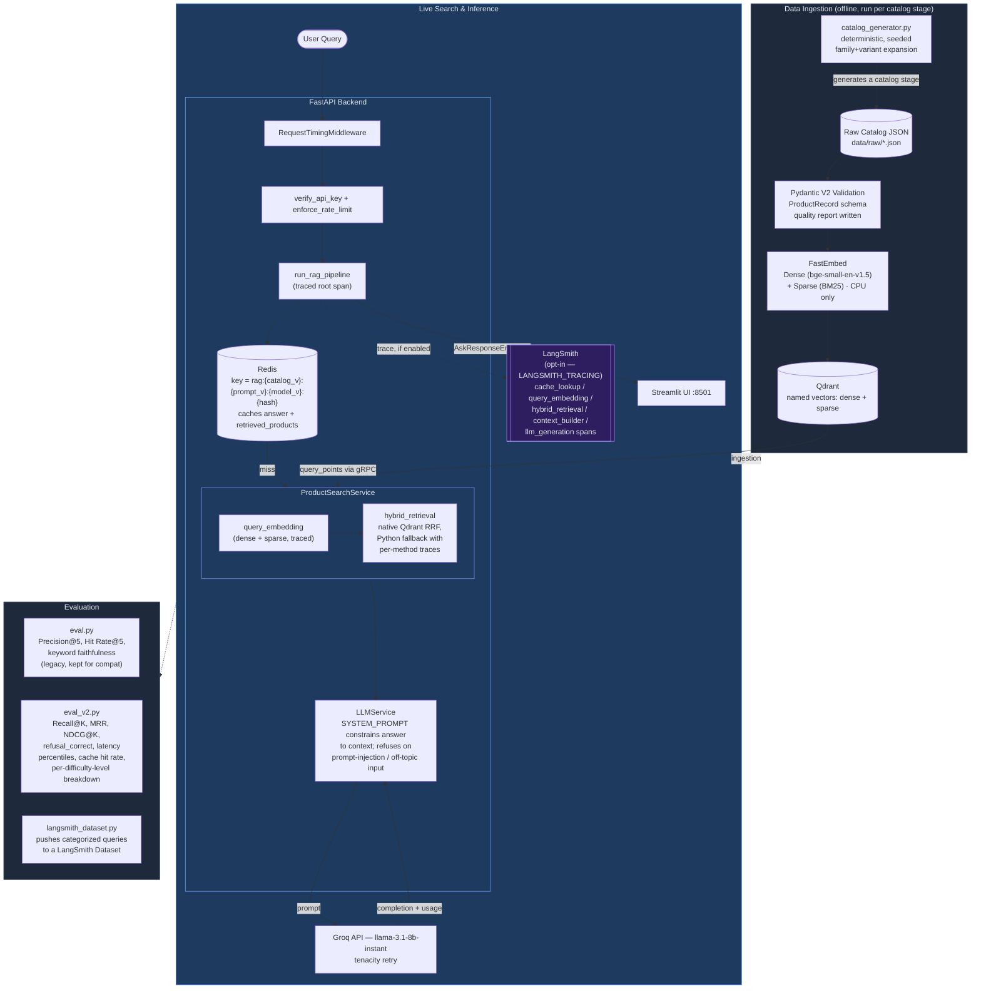

# E-Commerce Semantic Search & RAG Pipeline

A hybrid search and Retrieval-Augmented Generation (RAG) engine for e-commerce product discovery. Dense + sparse vector retrieval fused with Reciprocal Rank Fusion, served through an async FastAPI backend, observed end-to-end with LangSmith, evaluated with a difficulty-tiered benchmark, and containerized with Docker Compose.

This is an **evolution** of an already-working RAG application — see [Known Limitations](#known-limitations) and [Future Roadmap](#future-roadmap) for what's deliberately *not* built yet, and why.

---

## Architecture



### Why Naive RAG Fails in Production

1. **SKU mismatch** — Dense embeddings capture semantic similarity, not exact token matches. Pure semantic search fails precision-critical queries like an exact model number.
2. **Keyword blindness** — Sparse retrieval (BM25) solves SKU matching but fails on abstract queries like "comfortable headphones for long flights."

This system runs dense and sparse retrieval against the same collection and fuses the two rankings with Reciprocal Rank Fusion (RRF).

---

## Tech Stack

| Layer | Technology |
|---|---|
| Vector Database | Qdrant (Docker), named vectors: `dense` + `sparse` |
| Dense Embeddings | `BAAI/bge-small-en-v1.5` via FastEmbed |
| Sparse Embeddings | BM25 via FastEmbed (`Qdrant/bm25`) |
| Fusion Algorithm | Reciprocal Rank Fusion (RRF, k=60) — native Qdrant query with Python fallback |
| Backend API | FastAPI (async) + Uvicorn |
| LLM | Groq `llama-3.1-8b-instant`, retried with `tenacity` |
| Cache / Rate Limiting | Redis 7 (Docker), versioned cache keys |
| Observability | **LangSmith** (opt-in, `langsmith` SDK — no LangChain migration) |
| Frontend | Streamlit + pandas |
| Validation | Pydantic V2 / pydantic-settings |
| Logging | Loguru (structured, per-request) |
| Testing | pytest, pytest-asyncio, fakeredis |
| CI | GitHub Actions (`.github/workflows/ci.yml`) |
| Containerization | Docker Compose (4 services: qdrant, redis, backend, frontend) |

---

## LangSmith Observability

**Design principle: LangSmith observes the existing pipeline. The application was NOT migrated to LangChain.** Every traced function is a plain Python function decorated with the standalone `langsmith` SDK's `@traceable` — see `src/backend/observability/tracing.py`.

### How it works

- `config/settings.py` reads `LANGSMITH_TRACING` / `LANGSMITH_API_KEY` / `LANGSMITH_PROJECT` / `LANGSMITH_ENDPOINT` from `.env` and mirrors them into `os.environ` (the SDK's own contract) **only** when tracing is explicitly enabled and a key is present. Otherwise it force-sets `LANGSMITH_TRACING=false`, so a stray env var elsewhere can never silently turn tracing on.
- `src/backend/observability/tracing.py` re-exports `traceable`. If the `langsmith` package somehow isn't installed, it falls back to a no-op decorator — the app never hard-depends on the tracing library being importable.
- Every `@traceable`-decorated call is a normal function call when tracing is off — no client construction, no network activity. This is enforced by the SDK itself and verified in `tests/test_langsmith.py`.
- A tracing/network failure is fully isolated: earlier in this build, an invalid LangSmith key caused repeated `403 Forbidden` errors that were logged and swallowed; every `/ask` and `/search` request still returned `200` correctly throughout. **Verified live** with a working key: a real `/ask` request produced a `rag_pipeline` root run in the `ecommerce-rag-engine` LangSmith project with the exact designed child spans (`cache_lookup`, `hybrid_retrieval`, `context_builder`, `llm_generation`) and correct inputs (`{"query": ..., "limit": ...}` only — confirming the secret-allowlist guard below works against the real API, not just in unit tests).

### Trace tree

```
rag_pipeline                 (chain — root span, endpoint metadata attached here)
├── cache_lookup             (tool — cache_hit true/false in outputs)
├── query_embedding          (chain)
│   ├── dense_embedding      (tool)
│   └── sparse_embedding     (tool)
├── hybrid_retrieval         (retriever — retrieval_type: native/fallback)
│   ├── native_rrf_fusion    (retriever)  — OR, if native fails —
│   ├── dense_retrieval      (retriever)
│   ├── sparse_retrieval     (retriever)
│   └── rrf_fusion           (tool)
├── context_builder          (tool)
└── llm_generation           (chain)
    └── groq_completion      (llm — model, prompt, answer, token usage)
```

`search_pipeline` (the `/search` endpoint) traces the same `hybrid_retrieval` subtree without the cache/LLM stages.

**Known limitation:** Qdrant's native single-round-trip RRF fusion query doesn't expose which of the two prefetch branches (dense vs. sparse) contributed each hit — so per-method attribution (`dense_retrieval`/`sparse_retrieval`/`rrf_fusion` spans) is only available on the fallback path, which normally only runs if the native query fails. This is a real constraint of Qdrant's fusion API, not a gap in the tracing code; documented rather than worked around with an extra always-on query that would slow down every request just for observability.

### Metadata captured (never secrets)

`environment`, `endpoint`, `top_k`, `catalog_version`, `prompt_version`, `embedding_model`, `sparse_model`, `llm_model`, plus per-span outputs: retrieved product IDs/scores, RRF scores, cache hit/miss, context sent to the LLM, the generated answer, and Groq token usage.

`run_rag_pipeline` is explicitly guarded with `process_inputs=only_fields("query", "limit")` (see `tracing.only_fields`) — its other arguments are live service objects, one of which (`LLMService.client`, a `groq.Groq` instance) holds the real API key as a plain attribute. This allowlist means those objects are never even considered by the trace serializer, regardless of the SDK's internal (and version-dependent) serialization behavior. No API keys, Authorization headers, or Redis/Qdrant credentials are ever passed as arguments to a traced function in this codebase.

### Enabling it

```bash
# .env
LANGSMITH_TRACING=true
LANGSMITH_API_KEY=lsv2_sk_...
LANGSMITH_PROJECT=ecommerce-rag-engine
LANGSMITH_ENDPOINT=https://api.smith.langchain.com
```

Restart the backend; traces appear at smith.langchain.com under the configured project. Leave `LANGSMITH_TRACING=false` (or unset) for local/demo use — the app is byte-for-byte identical in behavior either way, verified in `tests/test_langsmith.py`.

### LangSmith dataset

```bash
python -m src.evaluation.langsmith_dataset --ground-truth src/evaluation/ground_truth_100.json
```

Pushes all 31 categorized queries from `ground_truth_100.json` to a LangSmith Dataset named `ecommerce-rag-eval`, tagged by category: `simple_semantic` (8), `attribute` (4), `price` (3), `multi_constraint` (4), `ambiguous` (4), `negative` (4), `adversarial` (4) — prompt injection / off-topic / unavailable-attribute requests. **Verified live**: dataset created and all 31 examples uploaded successfully to the configured LangSmith project.

---

## Retrieval Pipeline

```text
Query
  → dense embedding (bge-small-en-v1.5) + sparse embedding (BM25), in parallel
  → Qdrant native RRF fusion query (Prefetch dense + Prefetch sparse, k=60)
      on failure → parallel dense/sparse query_points + Python RRF fallback
  → top-K products
  → context blob
  → Groq llama-3.1-8b-instant (context-constrained, retries via tenacity)
  → answer
```

**Not implemented this pass** (see [Future Roadmap](#future-roadmap)): reranking, structured metadata filtering, query understanding. These are explicitly gated in the spec on having a stable larger-catalog baseline to benchmark against — which this pass produced (see [Evaluation](#evaluation) below).

---

## Product Catalog

### Schema (Part 8)

Original required fields — `id`, `title`, `description`, `price`, `category`, `metadata` — are unchanged. New fields are **all optional**, so the 39-product baseline validates exactly as before: `brand`, `rating` (0-5), `review_count`, `stock`, `tags`, `features`, `colors`, `sizes`, `specifications`, `discount`, `availability` (`in_stock`/`out_of_stock`/`preorder`/`discontinued`).

Validation (`src/ingestion/schemas.py`) rejects: empty/missing titles, negative prices, malformed metadata/specifications, out-of-range ratings, negative stock, invalid availability values, and duplicate IDs (checked across the *whole* catalog, not per-batch — a bug in the original per-batch validation that would have missed cross-batch duplicates).

### Catalog expansion (Part 7/9)

`src/ingestion/catalog_generator.py` is a deterministic, seeded generator (`--seed 42` by default — same seed always produces byte-identical output). Rather than hand-typing products, it expands a fixed set of **families** (e.g. "Noise Cancelling Headphones") into 1-3 **variants** each, differing on concrete attributes (price, battery, weight, brand, rating, features) — the near-duplicate-by-design structure the spec asks for, so retrieval evaluation can distinguish "found *a* headphone" from "found *the right* headphone."

```bash
python -m src.ingestion.catalog_generator --target 100 --seed 42 --output data/raw/products_100.json
python -m src.ingestion.ingest --data-path data/raw/products_100.json --catalog-version stage-100 --recreate
```

**Catalog stages actually generated in this pass: 39 → 100.** 250/500/1000 are **not** generated yet — the generator supports them (add more families to `FAMILIES`, run with `--target 250` etc.), but each stage is meant to be ingested and evaluated before moving to the next, per the spec's own "don't blindly increase products" rule. This is documented as the next step, not claimed as done.

| | Before (39) | After (100) |
|---|---|---|
| Total records | 39 | 100 |
| Valid records | 39 | 100 |
| Invalid records | 0 | 0 |
| Duplicate IDs | 0 | 0 |
| Categories | 8 | 12 (all target categories represented) |

Category breakdown (100-product stage): Electronics 21, Outdoor Gear 12, Sports & Fitness 9, Clothing 9, Home Office 8, Footwear 7, Home Appliances 7, Nutrition 6, Travel 6, Gaming 6, Kitchen 5, Personal Care 4.

Full ingestion quality report: `data/reports/ingestion_report_stage-100.json`.

---

## Cache Correctness (Part 14)

Cache keys are versioned: `rag:cache:{CATALOG_VERSION}:{PROMPT_VERSION}:{MODEL_VERSION}:{md5(query)}`. Bumping any of the three version strings in `.env` (e.g. after re-ingesting a new catalog stage) invalidates every previously cached answer automatically — no manual `FLUSHALL` needed, and a stale answer from the old catalog/prompt/model can never be served after a switch.

**Bug found and fixed during this pass:** the cache previously stored only the answer *text*. A cache hit therefore always returned `retrieved_products: []`, which silently zeroed out every retrieval metric (Precision@5, Recall@K, ...) on any evaluation run that happened to hit a warm cache — a real evaluation blind spot, not a hypothetical one (reproduced in `data/reports/eval_report_baseline-39.json`'s history). Fixed by caching the full `{answer, retrieved_products}` envelope; old plain-string cache entries degrade gracefully (treated as the answer with an empty product list) rather than crashing. Regression test: `tests/test_rag_pipeline.py`.

---

## Evaluation

Two evaluation suites, by design:

- **`src/evaluation/eval.py`** — the original suite (Precision@5, Hit Rate@5, keyword-overlap faithfulness). Kept byte-for-byte for backward compatibility; still passes against both the 39- and 100-product catalogs.
- **`src/evaluation/eval_v2.py`** — extends it with Recall@K, MRR, NDCG@K, a `refusal_correct` metric for negative/adversarial queries, latency percentiles (P50/P95/P99), cache hit rate, and a per-difficulty-level breakdown. Optional `--llm-judge` flag adds LLM-as-judge `faithfulness_semantic` / `answer_relevance` / `context_relevance` (extra Groq calls, off by default).

### Lexical heuristic vs. semantic evaluation — explicitly distinguished

`faithfulness_lexical` (both scripts) is **keyword overlap**, not true faithfulness — a well-paraphrased correct answer can score low, and a wrong answer that happens to repeat catalog vocabulary can score high. `faithfulness_semantic`, `answer_relevance`, and `context_relevance` are genuine LLM-as-judge metrics, gated behind `--llm-judge` because they cost an extra Groq call per test case. When not measured, the report says exactly that — `"not_measured"` — never a fabricated number.

### Ground truth (`src/evaluation/ground_truth_100.json`)

31 structured test cases (`query`, `expected_product_ids`, `reference_answer`, `expected_facts`) tagged with a Part-10 difficulty level: `exact_lexical`, `semantic_paraphrase`, `attribute_based`, `price_constraint`, `multi_constraint`, `ambiguous`, `negative`, `adversarial` (prompt injection + off-topic + unavailable-attribute requests).

### Results — measured, not projected

**Baseline (39 products, legacy `ground_truth.json`, `eval_v2.py`):**

| Metric | Score |
|---|---|
| Precision@5 | 0.2800 |
| Hit Rate@5 | 1.0000 |
| Recall@5 | 0.9778 |
| MRR | 1.0000 |
| NDCG@5 | 0.9667 |
| Faithfulness (lexical) | 0.8500 |
| Faithfulness (semantic) | Not measured |
| Answer Relevance | Not measured |
| Latency P50 / P95 | 3303ms / 5375ms |
| Cache Hit Rate | 1.0000 (second pass, TTL warm) |

**After expansion (100 products, `ground_truth_100.json`, 28 cases with a definable answer + 3 pure price-constraint cases, `eval_v2.py --gate`):**

| Metric | Score |
|---|---|
| Precision@5 | 0.2714 |
| Hit Rate@5 | 1.0000 |
| Recall@5 | 0.9077 |
| MRR | 0.8875 |
| NDCG@5 | 0.8908 |
| refusal_correct | 1.0000 |
| Faithfulness (lexical) | 0.5750 (see note below) |
| Faithfulness (semantic) | Not measured |
| Answer Relevance | Not measured |
| Latency P50 / P95 / P99 | 4239ms / 5603ms / 6317ms |
| Cache Hit Rate | 1.0000 |

Per-level breakdown (Recall@5 / MRR / NDCG@5): `exact_lexical` 1.00/1.00/1.00 · `multi_constraint` 1.00/0.88/0.92 · `attribute_based` 1.00/0.75/0.82 · `semantic_paraphrase` 0.92/0.81/0.80 · `ambiguous` 0.62/1.00/0.91 · `negative`/`adversarial` n/a (no expected products by design — scored via `refusal_correct` instead).

**Full quality gate: PASS** (`src/evaluation/thresholds.json` documents *why* each threshold was chosen). Reports: `data/reports/eval_report_baseline-39.json`, `data/reports/eval_report_stage-100.json`.

**Interesting finding, not hidden:** `refusal_correct` was initially **0.625** — the system correctly declined genuine "no matching product" queries (4/4) but partially engaged with prompt-injection-style adversarial queries (0/3) instead of giving the flat refusal. Fixed with one added rule to `LLMService.SYSTEM_PROMPT` treating the user message as untrusted input rather than an instruction; re-measured at **1.0000** with no measurable retrieval-quality cost (Recall@5 unchanged at 0.9077). `faithfulness_lexical` moved from 0.72 to 0.575 across the two runs — this reflects normal LLM output variance at `temperature=0.2`, not a regression (both figures are well above the documented 0.40 floor, which is intentionally lenient given this is a keyword heuristic).

Run it yourself:
```bash
python src/evaluation/eval.py
python src/evaluation/eval_v2.py --ground-truth src/evaluation/ground_truth_100.json --catalog-version stage-100 --gate
python src/evaluation/eval_v2.py --ground-truth src/evaluation/ground_truth_100.json --llm-judge   # adds semantic metrics
```

---

## Testing

`tests/` — 60 tests, all passing, none dependent on live external services by default:

- **Ingestion**: valid/invalid products, duplicate IDs, malformed metadata, cross-batch duplicate detection.
- **Retrieval**: RRF fusion math (agreement boosts rank, dedup across methods, limit respected, empty input).
- **Cache**: key versioning (catalog/prompt/model), get/set/TTL/invalidate (via `fakeredis`), the cache-envelope bug fix.
- **RAG pipeline**: cache hit/miss/no-results branches, legacy plain-string cache values degrade gracefully.
- **API**: `/search` and `/ask` (mocked services, real service objects never constructed), request validation, `X-API-Key` auth on/off, rate limiting.
- **LLM**: successful generation, retry-then-fail behavior, exact retry count.
- **LangSmith**: tracing disabled → identical behavior; the `process_inputs` secret-allowlist guard; a real-run integration test marked `@pytest.mark.integration` (skipped unless `pytest -m integration` and a real key is present).

```bash
pip install -r requirements-dev.txt
python -m pytest tests/ -v                 # unit tests only (default)
python -m pytest tests/ -v -m integration   # requires a live LangSmith key
```

## CI/CD

`.github/workflows/ci.yml` — two jobs:

1. **`test`** (always runs, no secrets needed): installs deps, validates both catalog stages (`ingest.py --validate-only`), runs the full unit suite.
2. **`evaluate`** (runs only if the `GROQ_API_KEY` repo secret is configured): spins up real Qdrant + Redis service containers, ingests the 100-product catalog, starts the actual FastAPI backend, and runs `eval_v2.py --gate` — a genuine end-to-end check, not mocked. Fails the build if Recall@5, MRR, Hit Rate@5, `refusal_correct`, or `faithfulness_lexical` fall below the documented thresholds in `thresholds.json`.

Its steps were verified by running the equivalent commands locally (see [Known Limitations](#known-limitations) for the one open item: it hasn't run inside GitHub Actions itself yet).

---

## Performance Observability (Part 15)

`AskResponseEnvelope.timing` breaks down every request into `cache_lookup_ms`, `search_ms`, `llm_ms`, `total_ms` — visible without instrumenting anything externally, and additionally captured per-span when LangSmith tracing is on. `eval_v2.py` aggregates P50/P95/P99 across a whole run rather than only an average, since a single mean hides tail latency (in this catalog's case, the LLM generation step dominates total latency at ~3-4s per request, dwarfing embedding/retrieval which run in tens of milliseconds).

---

## API Reference

Unchanged from the original design — this evolution deliberately did not break `/search` or `/ask`.

### POST /api/v1/search
```json
Request:  {"q": "waterproof hiking bag", "limit": 5}
Response: {"results": [...], "latency_ms": 45.2}
```

### POST /api/v1/ask
```json
Request:  {"q": "waterproof hiking bag", "limit": 5}
Response: {
  "answer": "...",
  "source": "cache" | "llm" | "llm_error" | "no_results",
  "retrieved_products": [...],
  "timing": {"cache_lookup_ms": ..., "search_ms": ..., "llm_ms": ..., "total_ms": ...}
}
```

Both accept an optional `X-API-Key` header (required only if `API_KEY` is set). `/ask` is additionally rate-limited (`RATE_LIMIT_PER_MINUTE`, default 30/min per client IP).

---

## Local Setup & Launch

### Prerequisites
- Docker Desktop, Python 3.11+, a Groq API key (free at console.groq.com)

### Setup
```bash
git clone https://github.com/sunilsaini01/ecommerce-rag-engine.git && cd ecommerce-rag-engine
cp .env.example .env   # set GROQ_API_KEY; LangSmith/API_KEY optional
docker-compose up --build -d
pip install -r requirements-backend.txt
python -m src.ingestion.ingest --data-path data/raw/sample_products.json --catalog-version baseline-39
```
- **Frontend**: http://localhost:8501 · **Backend docs**: http://localhost:8000/docs · **Qdrant dashboard**: http://localhost:6333/dashboard

To run against the larger 100-product catalog instead:
```bash
python -m src.ingestion.catalog_generator --target 100 --output data/raw/products_100.json
python -m src.ingestion.ingest --data-path data/raw/products_100.json --catalog-version stage-100 --recreate
# then set CATALOG_VERSION=stage-100 in .env and restart the backend container
```

## Environment Variables

| Variable | Default | Purpose |
|---|---|---|
| `QDRANT_HOST` / `QDRANT_PORT` / `QDRANT_GRPC_PORT` | `localhost` / `6333` / `6334` | Qdrant connection |
| `COLLECTION_NAME` | `ecommerce_products` | Qdrant collection |
| `GROQ_API_KEY` | — | Required for `/ask` |
| `REDIS_HOST` / `REDIS_PORT` | `localhost` / `6379` | Cache/rate-limit backing store |
| `API_KEY` | *(blank = auth off)* | `X-API-Key` enforcement |
| `RATE_LIMIT_PER_MINUTE` | `30` | `/ask` per-IP limit |
| `ENVIRONMENT` | `local` | Tag on every trace/log |
| `CATALOG_VERSION` / `PROMPT_VERSION` / `MODEL_VERSION` | `baseline-39` / `v1` / `llama-3.1-8b-instant` | Cache key versioning |
| `LANGSMITH_TRACING` | `false` | Master on/off switch |
| `LANGSMITH_API_KEY` | — | Required if tracing is on |
| `LANGSMITH_PROJECT` | `ecommerce-rag-engine` | LangSmith project name |
| `LANGSMITH_ENDPOINT` | `https://api.smith.langchain.com` | LangSmith API endpoint |

---

## Project Structure
```
ecommerce-rag-engine/
├── .github/workflows/ci.yml
├── config/settings.py
├── data/
│   ├── raw/{sample_products.json, products_100.json}
│   └── reports/                    # generated, gitignored
├── src/
│   ├── ingestion/
│   │   ├── schemas.py              # ProductRecord + validate_catalog + IngestionReport
│   │   ├── catalog_generator.py    # deterministic family/variant catalog generator
│   │   ├── embedder.py
│   │   └── ingest.py
│   ├── backend/
│   │   ├── main.py
│   │   ├── observability/tracing.py   # LangSmith layer
│   │   ├── api/{middleware.py, security.py, v1/}
│   │   ├── models/api_schemas.py
│   │   └── services/
│   │       ├── search.py           # hybrid retrieval + RRF, per-stage tracing
│   │       ├── cache.py            # versioned keys, envelope caching
│   │       ├── llm.py              # Groq + injection-hardened system prompt
│   │       ├── context_builder.py
│   │       └── rag_pipeline.py     # traced orchestrator used by /ask
│   ├── frontend/
│   └── evaluation/
│       ├── ground_truth.json           # legacy, 15 cases
│       ├── ground_truth_100.json       # 31 cases, difficulty-tiered
│       ├── thresholds.json             # documented CI gate thresholds
│       ├── eval.py                     # legacy suite
│       ├── eval_v2.py                  # extended suite
│       └── langsmith_dataset.py
├── tests/
├── Dockerfile.backend / Dockerfile.frontend / docker-compose.yml
└── requirements-backend.txt / requirements-frontend.txt / requirements-dev.txt
```

---

## Known Limitations

- **Reranking, metadata filtering, and query understanding are not implemented.** The spec explicitly gates these on having a stable larger-catalog baseline — this pass produced exactly that baseline (100-product catalog + full metric suite), so they're now well-defined next steps rather than guesses.
- **Catalog stages 250/500/1000 don't exist yet.** The generator supports them; each stage should be ingested and evaluated before the next per the spec's staged-growth rule.
- **LLM-as-judge metrics (`faithfulness_semantic`, `answer_relevance`, `context_relevance`) were not run** in the numbers reported above — `--llm-judge` exists and works, but doubles Groq calls per evaluation run and was left opt-in.
- **Per-method retrieval attribution (dense vs. sparse) is only available when the Python fallback path runs**, not on the default native-fusion fast path — a genuine Qdrant API constraint, not a tracing gap (see LangSmith section above).
- **GitHub Actions CI has not actually been run yet.** `.github/workflows/ci.yml` exists and its steps were verified by running the equivalent commands locally, but no push has been made from this session to trigger a real workflow run.
- **Rate limiting is a simple fixed-window counter** keyed on `request.client.host` — spoofable behind a proxy that doesn't set a trusted `X-Forwarded-For`, and allows a burst near the window boundary. Pre-existing, unchanged in this pass.
- **Embedding model** (`bge-small-en-v1.5`) and **sparse model** (BM25) are unchanged — a larger dense model or a neural sparse model (SPLADE) remain open, unevaluated options.

## Future Roadmap

In the order the measured evidence in this README actually supports:

1. **Catalog stage 250** — ingest + evaluate + compare against the 100-product numbers above before deciding whether to continue to 500/1000.
2. **Metadata filtering** (Part 12) — the schema already carries `price`, `rating`, `stock`, `category` in every Qdrant payload; wiring structural Qdrant filters for price/category constraints is now schema-ready.
3. **Reranking benchmark** (Part 11) — only after a filtering-capable, larger-catalog baseline exists, per the spec's own "benchmark before adopting" rule; this pass's `by_level` breakdown (e.g. `attribute_based` MRR at 0.75) is exactly the kind of signal that should decide whether reranking is worth its added latency.
4. **Query understanding** (Part 13) — only after retrieval quality is stably measurable at a larger scale, which now applies.
